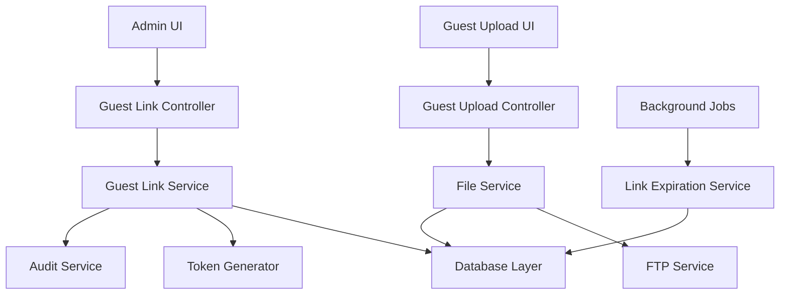

# Guest Link Generation Design

## Overview

The guest link generation feature enables administrators to create secure, configurable upload links for channels. The system leverages the existing `GuestUploadLink` database model and integrates with the current channel management interface to provide a seamless experience for creating and managing guest upload access.

## Architecture

### System Components



### Data Flow

1. **Link Creation**: Admin creates link → Service generates token → Database stores link → UI displays URL
2. **Guest Upload**: Guest accesses link → Validates token → Uploads file → Updates counters → Stores file
3. **Link Management**: Admin views links → Service retrieves data → UI displays management options

## Components and Interfaces

### Backend Components

#### 1. Guest Link Controller (`/backend/src/controllers/guestLinkController.ts`)

```typescript
interface GuestLinkController {
  createGuestLink(req: AuthenticatedRequest, res: Response): Promise<void>
  getChannelGuestLinks(req: AuthenticatedRequest, res: Response): Promise<void>
  updateGuestLink(req: AuthenticatedRequest, res: Response): Promise<void>
  deleteGuestLink(req: AuthenticatedRequest, res: Response): Promise<void>
  validateGuestLink(req: Request, res: Response): Promise<void>
  uploadViaGuestLink(req: Request, res: Response): Promise<void>
}
```

#### 2. Guest Link Service (`/backend/src/services/guestLinkService.ts`)

```typescript
interface GuestLinkService {
  createLink(channelId: string, config: GuestLinkConfig, createdBy: string): Promise<ApiResponse>
  getChannelLinks(channelId: string): Promise<ApiResponse>
  validateToken(token: string): Promise<ApiResponse>
  updateLink(linkId: string, updates: Partial<GuestLinkConfig>): Promise<ApiResponse>
  deactivateLink(linkId: string): Promise<ApiResponse>
  incrementUploadCount(linkId: string): Promise<void>
  cleanupExpiredLinks(): Promise<void>
}
```

#### 3. Token Generator Utility (`/backend/src/utils/tokenGenerator.ts`)

```typescript
interface TokenGenerator {
  generateSecureToken(): string
  generateGuestUploadUrl(token: string): string
}
```

### Frontend Components

#### 1. Guest Link Management Modal (`/frontend/src/components/admin/GuestLinkModal.tsx`)

```typescript
interface GuestLinkModalProps {
  isOpen: boolean
  channelId: string
  channelName: string
  onClose: () => void
  onSuccess: () => void
}
```

#### 2. Guest Link List Component (`/frontend/src/components/admin/GuestLinkList.tsx`)

```typescript
interface GuestLinkListProps {
  channelId: string
  links: GuestUploadLink[]
  onEdit: (link: GuestUploadLink) => void
  onDelete: (linkId: string) => void
  onToggleActive: (linkId: string, isActive: boolean) => void
}
```

#### 3. Guest Upload Page (`/frontend/src/pages/GuestUploadPage.tsx`)

```typescript
interface GuestUploadPageProps {
  token: string // from URL params
}
```

## Data Models

### Existing GuestUploadLink Model (Already in Schema)

```typescript
interface GuestUploadLink {
  id: string
  token: string
  channelId: string
  guestFolder?: string
  description?: string
  expiresAt?: Date
  maxUploads?: number
  uploadCount: number
  isActive: boolean
  createdBy: string
  createdAt: Date
  updatedAt: Date
}
```

### API Request/Response Models

```typescript
interface CreateGuestLinkRequest {
  channelId: string
  description?: string
  expiresAt?: string
  maxUploads?: number
  guestFolder?: string
}

interface GuestLinkResponse {
  id: string
  token: string
  url: string
  channelId: string
  channelName: string
  description?: string
  expiresAt?: string
  maxUploads?: number
  uploadCount: number
  guestFolder?: string
  isActive: boolean
  createdAt: string
  updatedAt: string
}
```

## Error Handling

### Error Scenarios

1. **Invalid Token**: Return 404 with user-friendly message
2. **Expired Link**: Return 410 Gone with expiration notice
3. **Upload Limit Reached**: Return 429 Too Many Requests
4. **Inactive Link**: Return 403 Forbidden
5. **File Validation Errors**: Return 400 with specific validation messages
6. **Storage Errors**: Return 500 with generic error message

### Error Response Format

```typescript
interface GuestLinkError {
  code: 'INVALID_TOKEN' | 'EXPIRED_LINK' | 'UPLOAD_LIMIT_REACHED' | 'INACTIVE_LINK'
  message: string
  details?: string
}
```

## Testing Strategy

### Unit Tests

1. **Token Generation**: Verify uniqueness and security
2. **Link Validation**: Test all validation scenarios
3. **Upload Counter**: Verify increment logic and limits
4. **Expiration Logic**: Test date-based validation

### Integration Tests

1. **End-to-End Link Creation**: Admin creates → Guest uploads
2. **File Upload Flow**: Complete upload process via guest link
3. **Link Management**: CRUD operations on guest links
4. **Security**: Unauthorized access attempts

### UI Tests

1. **Modal Interactions**: Create/edit guest link modals
2. **Link Display**: Proper rendering of link lists and details
3. **Guest Upload Interface**: File selection and upload progress
4. **Error States**: Proper error message display

## Security Considerations

### Token Security

- Use cryptographically secure random token generation
- Tokens should be at least 32 characters long
- Implement rate limiting on guest upload endpoints
- Log all guest upload activities for audit

### Access Control

- Only ADMIN users can create/manage guest links
- Validate channel ownership before link creation
- Implement CSRF protection on guest upload forms
- Sanitize all file uploads and validate file types

### Data Protection

- Store minimal guest information
- Implement automatic cleanup of expired links
- Audit all guest link operations
- Secure file storage with proper permissions

## Performance Considerations

### Optimization Strategies

1. **Caching**: Cache active guest links for faster validation
2. **Database Indexing**: Index on token field for quick lookups
3. **File Upload**: Stream uploads directly to FTP to minimize memory usage
4. **Background Jobs**: Async cleanup of expired links

### Monitoring

- Track guest link usage metrics
- Monitor upload success/failure rates
- Alert on suspicious activity patterns
- Performance metrics for upload speeds

## Implementation Notes

### Integration Points

1. **Channel Management UI**: Add guest link management to existing channel details
2. **File Service**: Extend to handle guest uploads with proper attribution
3. **Audit Service**: Log all guest link operations and uploads
4. **FTP Service**: Ensure guest uploads go to correct channel/folder paths

### URL Structure

- Guest upload URL: `/guest-upload/{token}`
- Admin management: Integrated into existing channel management
- API endpoints: `/api/admin/channels/{channelId}/guest-links`

### Configuration

- Maximum guest links per channel (default: 10)
- Default expiration period (default: 30 days)
- Maximum upload limit per link (default: 100)
- Allowed file types for guest uploads (inherit from system settings)